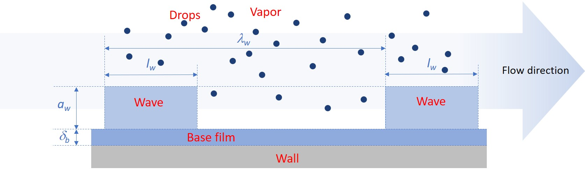

Four-field model
================

The four-field simulation framework in **OpenSTREAM** extends the traditional three-field model by explicitly representing disturbance waves, in addition to vapor, droplets, and the base liquid film. This modeling approach was originally developed in :cite:t:`LECORREMODEL` and :cite:t:`LeCorre2022NURETH19`. It provides improved resolution of annular two-phase flow dynamics, enabling more accurate and detailed simulations.

The four distinct flow fields: vapor, entrained droplets, base liquid film and disturbance waves, are illustrated in :numref:`fig-four-field-framework`.

.. _fig-four-field-framework:

   Field geometrical characteristics in the four-field simulation framework (vapor, drops, base film and waves).

The four-field model serves several key roles within OpenSTREAM:

- **Wave-resolved modeling**: Separates the liquid film into base film and disturbance waves, capturing their distinct transport behaviors and interactions.
- **Non-equilibrium dynamics**: Includes a Boltzmann-type wave number density transport equation to simulate wave formation, merging, and dissipation.
- **Enhanced predictive capability**: Enables detailed simulation of film dryout, wave-driven mass transport, and hydrodynamic transitions in developing annular flow.

By explicitly modeling disturbance waves and their interactions with other flow fields, the four-field framework offers state-of-the-art capabilities for simulating complex annular flow phenomena, including intermittent film dryout.

An overview of the four-field model implemented in OpenSTREAM is provided below. A more detailed derivation and theoretical background can be found in :cite:t:`LECORREMODEL` and :cite:t:`LeCorre2025OpenSTREAM`.

Governing equations
-------------------

The conservation equations are formulated at the wall level, indexed by :math:`n`, to support multi-wall geometries with different heating rates. These equations are solved starting from the onset of annular two-phase flow. Upstream of this onset, the solution from the mixture solver is used to initialize the flow fields.

**1. Mass conservation**

Base Film: :math:`\frac{\partial}{\partial t}(\frac{W_b^n}{u_b^n}) + \frac{\partial W_b^n}{\partial z} = \Pi_{wall}^n (D_b - \Gamma_{wb,b}^n + \Psi_w^n - \Psi_b^n)`

Disturbance Waves: :math:`\frac{\partial}{\partial t}(\frac{W_w^n}{u_w^n}) + \frac{\partial W_w^n}{\partial z} = \Pi_{wall}^n (D_w - E^n - \Gamma_{wb,w}^n - \Psi_w^n + \Psi_b^n)`

where:

- :math:`W_b^n`, :math:`W_w^n` are the base film and wave mass flow rates for wall index :math:`n`
- :math:`u_b^n`, :math:`u_w^n` are the base film and wave velocities for wall index :math:`n`
- :math:`D_b`, :math:`D_w` are the drop deposition fluxes on the base film and wave fields
- :math:`\Gamma_{wb,b}^n`, :math:`\Gamma_{wb,w}^n` are the base film and wave wall boiling mass fluxes for wall index :math:`n`
- :math:`\Psi_w^n`, :math:`\Psi_b^n` are exchange mass fluxes between film and wave fields for wall index :math:`n`

**2. Momentum conservation**

Base Film: :math:`\rho_{ls} \delta_b^n (\frac{\partial u_b^n}{\partial t} + u_b^n \frac{\partial u_b^n}{\partial z}) = D_b (u_d - u_b^n) + \Psi_w^n (u_w^n - u_b^n) - \delta_b^n (\frac{\partial p}{\partial z} + \cos\theta g \rho_{ls}) + \beta_b^n \tau_{v,b}^n + (1 - \beta_b^n) \tau_{w,b}^n - \tau_{wall,b}^n`

Disturbance Waves: :math:`\rho_{ls} \delta_w^n (\frac{\partial u_w^n}{\partial t} + u_w^n \frac{\partial u_w^n}{\partial z}) = D_w (u_d - u_w^n) + \Psi_b^n (u_b^n - u_w^n) - \delta_w^n (\frac{\partial p}{\partial z} + \cos\theta g \rho_{ls}) + (1 - \beta_b^n) (\tau_{v,w}^n - \tau_{w,b}^n)`

where

- :math:`\rho_{ls}` is the saturated liquid density
- :math:`\delta_b^n`, :math:`\delta_w^n` are the base film and wave (equivalent) thicknesses for wall index :math:`n`
- :math:`u_d` is the drop velocity
- :math:`\beta_b^n` is the base film interfacial fraction
- :math:`\tau_{v,b}^n`, :math:`\tau_{v,w}^n` are the vapor/base film and vapor/wave interfacial shear stresses for wall index :math:`n`
- :math:`\tau_{w,b}^n` is the base film/wave interfacial shear stress
- :math:`\tau_{wall,b}^n` is the wall shear stress on the base film for wall index :math:`n`

**3. Energy conservation**

Base Film under thermal equilibrium: :math:`\Gamma_{wb,b}^n = \frac{{q^{\prime\prime}}_{wall,b}^n}{h_{vs} - h_{ls}}`

Disturbance Waves under thermal equilibrium: :math:`\Gamma_{wb,w}^n = \frac{{q^{\prime\prime}}_{wall,w}^n}{h_{vs} - h_{ls}}`

where:

- :math:`h_{vs}`, :math:`h_{ls}` are the saturated vapor and liquid specific enthalpies
- :math:`{q^{\prime\prime}}_{wall,b}^n`, :math:`{q^{\prime\prime}}_{wall,w}^n` are the wall heat flux to the base film and wave fields for wall index :math:`n`

**4. Wave number density transport**

:math:`\frac{\partial N_w^n}{\partial t} + \frac{\partial}{\partial z}(u_w^n N_w^n) = \frac{N_w^{eq,n} - N_w^n}{t_w^{Relax}}`

where:

- :math:`N_w^n` is the wave number density (spatial density of waves)
- :math:`N_w^{eq,n}` is the equilibrium wave number density
- :math:`t_w^{Relax}` is the relaxation time associated with wave formation, merging, and dissipation.

Closure models
--------------

To complete the conservation equations, several closure models are required:

- Same closure models as for the :doc:`three-field model <ThreeField_Model_Theory>`
- Base film/wave mass flow rate split at onset of annular two-phase flow
- Drop deposition split between base film and wave fields
- Exchange mass fluxes between film and waves: :math:`\Psi_w^n`, :math:`\Psi_b^n`
- Wall boiling split between base film and wave fields
- Base film interfacial fraction: :math:`\beta_b^n`
- Vapor/base film and vapor/wave interfacial shear stresses: :math:`\tau_{v,b}^n`, :math:`\tau_{v,w}^n`
- Base film/wave interfacial shear stress: :math:`\tau_{w,b}^n`
- Wall shear stress on the base film: :math:`\tau_{wall,b}^n`
- Equilibrium wave number density: :math:`N_w^{eq,n}`
- Relaxation time associated with wave formation, merging, and dissipation: :math:`t_w^{Relax}`

The selected closure models are defined in the OpenSTREAM model file, chosen from the available options listed in :mod:`InputEnums`. If not explicitly specified by the user, default models are applied as defined in :class:`Inputs.Model`. All closure models are implemented in :class:`Solvers.FourField.Wave` and :class:`Solvers.FourField.Base`, which the users can modify to suit specific simulation needs.

In addition, the thermodynamic properties for each phase are computed using `CoolProp <https://coolprop.org/>`_, an open-source thermophysical property library that provides accurate equations of state and transport properties for a wide range of fluids.

Features and assumptions
------------------------

- Supports both steady-state and transient simulations in straight channels
- Supports uniform and non-uniform wall heat flux distribution
- Models intermittent wave transport and non-equilibrium wave dynamics
- Includes wave-film exchange and wave number density evolution
- Assumes thermal equilibrium (no temperature difference between phases)
- Supports multi-wall geometries (e.g., annuli)
- Neglects minor contributions such as frictional heating and temporal pressure gradient contributions

Role in OpenSTREAM
------------------

The four-field model provides state-of-the-art simulation capabilities for annular two-phase flow, including in developing flow regions. It captures wave dynamics and their impact on mass and momentum transfer.

----

Implementation notes
--------------------

Package

- :mod:`Solvers`

Module

- :mod:`Solvers.FourField`

Four-field solver class

- :class:`Solvers.FourField.FourFieldSolver`

Field classes

- :class:`Solvers.FourField.Wave`
- :class:`Solvers.FourField.Base`
- :class:`Solvers.FourField.Drop`

Key solver methods

- :meth:`Solvers.FourField.FourFieldSolver.solve()`

Key field properties:

- :attr:`Solvers.FourField.Wave.W`
- :attr:`Solvers.FourField.Wave.U`
- :attr:`Solvers.FourField.Wave.FREQUENCY`
- :attr:`Solvers.FourField.Base.W`
- :attr:`Solvers.FourField.Base.U`
- :attr:`Solvers.ThreeField.Drop.W`, inherited by :class:`Solvers.FourField.Drop`
- :attr:`Solvers.ThreeField.Drop.U`, inherited by :class:`Solvers.FourField.Drop`
