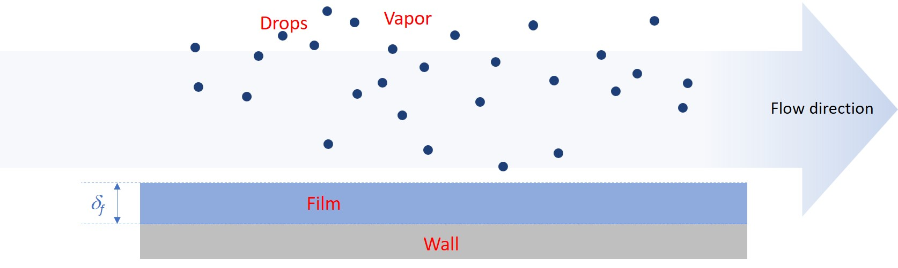

Three-field model
=================

The three-field simulation framework in **OpenSTREAM** provides a structured representation of annular two-phase flow by solving relevant conservation equations for the liquid film and droplet fields, with the vapor field derived from the mixture solver. This formulation is tailored for saturated flow conditions within a theoretical framework used in other codes, such as in subchannel analysis for Boiling Water Reactor (BWR) fuel simulations (:cite:t:`ADAMSSON20112843`)(:cite:t:`ADAMSSON2014316`).

   Figure 1: Field geometrical characteristics in the three-field simulation framework (vapor, drops and film).

The three-field model serves several key roles within OpenSTREAM:

- **Field separation**: Distinguishes between vapor, entrained droplets, and liquid film, enabling detailed modeling of annular flow dynamics.
- **Film and droplet transport**: Captures deposition and entrainment processes critical to predicting film dryout and droplet behavior.
- **Thermal equilibrium assumption**: Simplifies energy conservation while retaining essential mass and momentum exchanges.

By explicitly modeling the liquid film and droplet fields, the three-field framework enables accurate simulation of saturated annular flow regimes in single channels and supports advanced thermal-hydraulic analysis for various industrial applications.

An overview of the three-field model implemented in OpenSTREAM is provided below. A more detailed derivation and theoretical background can be found in :cite:t:`LeCorre2025OpenSTREAM`.

Governing equations
-------------------

The conservation equations are formulated at the wall level, indexed by :math:n, to support multi-wall geometries with different heating rates. These equations are solved starting from the onset of annular two-phase flow. Upstream of this onset, the solution from the mixture solver is used to initialize the flow fields.

**1. Mass conservation**

Film: :math:`\frac{\partial}{\partial t}(\frac{W_f^n}{u_f^n}) + \frac{\partial W_f^n}{\partial z} = \Pi_p^n (D - E^n - \Gamma_{wb}^n)`

where:

- :math:`W_f^n` is the liquid film mass flow rate for wall index :math:`n`
- :math:`u_f^n` is the liquid film velocity for wall index :math:`n`
- :math:`D` is the drop deposition mass flux
- :math:`E` is the film entrainment mass flux
- :math:`\Gamma_{wb}^n` is the wall boiling mass flux for wall index :math:`n`

The drop mass flow rate, :math:`W_d`, is simply computed by subtracting :math:`W_f` from the total liquid mass flow rate obtained from the mixture model.

**2. Momentum conservation**

Liquid Film: :math:`\rho_{ls} \delta_f^n (\frac{\partial u_f^n}{\partial t} + u_f^n \frac{\partial u_f^n}{\partial z}) = (u_d - u_f^n) D - \delta_f^n (\frac{\partial p}{\partial z} + \cos\theta g \rho_{ls}) + \tau_{v,f}^n - \tau_{w,f}^n`

Droplets: :math:`\rho_{ls} (\frac{\partial u_d}{\partial t} + u_d \frac{\partial u_d}{\partial z}) = (\sum \Pi_p^n (u_f^n - u_d) E^n) \frac{\rho_{ls} u_d}{W_d} - (\frac{\partial p}{\partial z} + \cos\theta g \rho_{ls}) + \frac{A_d}{V_d} \tau_{v,d}`

where:

- :math:`\rho_{ls}` is the saturated liquid density
- :math:`\delta_f^n` is the liquid film thickness for wall index :math:`n`
- :math:`u_d` is the drop velocity
- :math:`\tau_{v,f}^n` is the vapor/film interfacial shear stress for wall index :math:`n`
- :math:`\tau_{v,d}^n` is the vapor/drop interfacial shear stress
- :math:`\tau_{w,f}^n` is the wall shear stress on the liquid film for wall index :math:`n`
- :math:`A_d`, :math:`V_d` are the drop interfacial area and volume (based on surface averaging)

**3. Energy conservation**

Under thermal equilibrium: :math:`\Gamma_{wb}^n = \frac{{q^{\prime\prime}}_{w}^n}{h_{vs} - h_{ls}}`

where:

- :math:`h_{vs}`, :math:`h_{ls}` are the saturated vapor and liquid specific enthalpies
- :math:`{q^{\prime\prime}}_{w}^n is the wall heat flux for wall index :math:`n`

Closure relations
-----------------

To complete the conservation equations, several closure relations are required:

- Onset of annular two-phase flow
- Film/drop mass flow rate split at onset of annular two-phase flow
- Drop deposition mass flux: :math:`D`
- Film entrainement mass flux: :math:`E`
- Vapor/film interfacial shear stress: :math:`\tau_{v,f}^n`
- Vapor/drop interfacial shear stress: :math:`\tau_{v,d}^n`
- Wall shear stress on the liquid film: :math:`\tau_{w,f}^n`
- Drop interfacial area and volume: :math:`A_d`, :math:`V_d`

The selected closure models are defined in the OpenSTREAM model file, chosen from the available options listed in :mod:`InputEnums`. If not explicitly specified by the user, default models are applied as defined in :class:`Inputs.Model`. All closure relations are implemented in :class:`Solvers.ThreeField.Film` and :class:`Solvers.ThreeField.Drop`, which the users can modify to suit specific simulation needs.

In addition, the thermodynamic properties for each phase are computed using `CoolProp <https://coolprop.org/>`_, an open-source thermophysical property library that provides accurate equations of state and transport properties for a wide range of fluids.

Features and assumptions
------------------------

- Supports both steady-state and transient simulations in straight channels
- Supports uniform and non-uniform wall heat flux distribution
- Applicable up to film dryout
- Models drop deposition and film entrainment
- Assumes thermal equilibrium (no temperature difference between phases)
- Supports multi-wall geometries (e.g., annuli)
- Neglects minor contributions such as frictional heating and temporal pressure gradient contributions

Role in OpenSTREAM
------------------

The three-field model is the preferred framework for simulating annular two-phase flow up to the point of liquid film dryout. It offers detailed modeling of liquid film and droplet dynamics, making it particularly well-suited for advanced thermal-hydraulic analyses in Boiling Water Reactor (BWR) applications.

----

Implementation notes
--------------------

Package

- :mod:`Solvers`

Module

- :mod:`Solvers.ThreeField`

Three-field solver class

- :class:`Solvers.ThreeField.ThreeFieldSolver`

Field classes

- :class:`Solvers.ThreeField.Film`
- :class:`Solvers.ThreeField.Drop`

Key solver methods

- :meth:`Solvers.ThreeField.ThreeFieldSolver.solve()`

Key field properties:

- :attr:`Solvers.ThreeField.Film.W`
- :attr:`Solvers.ThreeField.Film.U`
- :attr:`Solvers.ThreeField.Drop.W`
- :attr:`Solvers.ThreeField.Drop.U`
