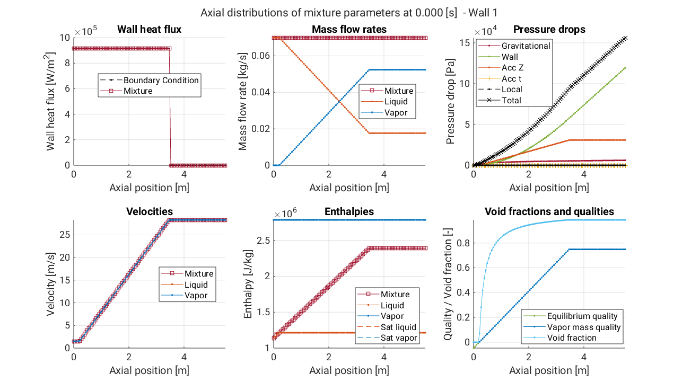

Run sample script
=================

After installation, you're all set to launch your first simulation!

As a first exercise, open MATLAB and run the commands listed below from within the ``openstream`` folder, which will simulate an example of boiling two-phase flow in a uniformly heated tube followed by an adiabatic region. The **OpenSTREAM** mixture model will be used, which defaults to the Homogeneous Equilibrium Model (HEM) when the physical models are not modified by the user.

This is the quickest and easiest way to start exploring what OpenSTREAM can do, and to confirm everything is working smoothly under the hood.

.. code-block:: matlab

    % Clear existing variables from workspace
    clearvars

    % Import the necessary classes for inputs and solvers
    import Inputs.*
    import Solvers.*
    import Solvers.Mixture.*

    % Turn off warnings during input setup
    warning off
    % Create the input set using paths to model, options, geometry, and boundary condition files
    inputSet = InputSet( ...
                modelFilePath         = './inputs/models.inp',  modelID    = 'TUTORIAL1', ...
                optionsFilePath       = './inputs/options.inp', optionsID  = 'DEFAULT', ...
                geometryFilePath      = './inputs/geom.inp',    geometryID = 'TUTORIAL1', ...
                bcFilePath            = './inputs/tutorial1.inp', ...
                sessionParentDir      = fullfile(pwd,'outputs'), ...
                overwriteSessionFiles = true, ...
                LOGMODE               = 'BOTH');  

    warning on      

    % Create a mixture solver object
    mixSolver = MixtureSolver(inputSet);

    % Solve
    mixSolver.solve();

    % Default axial plots
    mixSolver.plotz();

    % Save results
    mixSolver.save();

   Sample figure of axial distributions of mixture parameters.